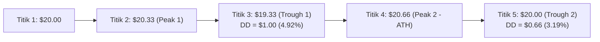

# 📋 Dokumen Laporan Komprehensif Audit QA: Paper Trading System

**Proyek:** Polymarket Weather Paper Trading  
**Peran:** QA / Auditor Sistem  
**Tanggal Audit:** 3 September 2026  
**Status Keseluruhan:** Audit Selesai — Modul Inti Teruji (30/30 Test PASS), Kesenjangan Service Layer Teridentifikasi  

---

## Daftar Isi
1. [Ringkasan Eksekutif](#1-ringkasan-eksekutif)
2. [Audit Settlement Engine (`settlement_engine.py`)](#2-audit-settlement-engine-settlement_enginepy)
   - [Trace Manual Numerik](#trace-manual-numerik)
   - [Bug Kritis yang Ditemukan & Diperbaiki](#bug-kritis-yang-ditemukan--diperbaiki)
   - [Bug Minor yang Ditemukan & Diperbaiki](#bug-minor-yang-ditemukan--diperbaiki)
   - [Hasil Eksekusi Unit Test](#hasil-eksekusi-unit-test-settlement-engine)
3. [Audit Metrics Engine (`metrics.py`)](#3-audit-metrics-engine-metricspy)
   - [Trace Manual Maximum Drawdown](#trace-manual-maximum-drawdown)
   - [Evaluasi Checklist Metrik Bisnis](#evaluasi-checklist-metrik-bisnis)
   - [Temuan Tambahan (Defensive Parsing)](#temuan-tambahan-defensive-parsing)
4. [Audit Caller & Service Layer Architecture](#4-audit-caller--service-layer-architecture)
   - [Status Implementasi File Caller](#status-implementasi-file-caller)
   - [Evaluasi 5 Aspek Integrasi](#evaluasi-5-aspek-integrasi)
5. [Roadmap Rekomendasi Implementasi](#5-roadmap-rekomendasi-implementasi)

---

## 1. Ringkasan Eksekutif

Audit independen ini dilakukan secara menyeluruh terhadap 3 pilar fungsional modul paper trading:
1. **Perhitungan Settlement & Risiko Pasar (`settlement_engine.py`)**: Memastikan presisi desimal tanpa bias lookahead, penanganan slippage/spread, proteksi risiko, dan perhitungan fee serta payout.
2. **Kalkulasi Metrik Kinerja Portofolio (`metrics.py`)**: Memvalidasi akurasi metrik finansial, khususnya Maximum Drawdown berbasis *High-Water Mark* (HWM), Win Rate posisi closed, ROI, serta Mark-to-Market (MTM) Unrealized P/L.
3. **Arsitektur Service Layer & Alur Eksekusi Database**: Menilai kesiapan integrasi antara logika bisnis matematika dengan persistensi database (`models.py`) dan antarmuka (`paper.py`, `dashboard.py`).

---

## 2. Audit Settlement Engine (`settlement_engine.py`)

### Trace Manual Numerik
Sebelum pengujian kode, validasi dilakukan dengan kalkulasi manual:
- **Trace 1 (Perhitungan Saham):**
  - Posisi: `$1.00`, Harga Entry: `$0.75`
  - Formula: $\text{Shares} = \frac{\text{Position}}{\text{Entry}} = \frac{1.00}{0.75} = 1.333333...$
  - Presisi 4 Desimal (`ROUND_HALF_UP`): **`1.3333`** (✅ Sesuai)
- **Trace 2 (Gross Profit Pemenang):**
  - Posisi: `$1.00`, Harga Entry: `$0.74`
  - Saham: $\frac{1.00}{0.74} = 1.351351... \rightarrow \mathbf{1.3514}$
  - Payout Polymarket ($1 per share): $1.3514 \times \$1.00 = \$1.3514$
  - Gross Profit: $\$1.3514 - \$1.0000 = \mathbf{\$0.3514}$ (✅ Sesuai)
- **Trace 3 (Dampak Fee 200 bps / 2%):**
  - Gross Profit: `$0.3514`, Fee Rate: $0.02$
  - Fees: $\$0.3514 \times 0.02 = \$0.007028 \rightarrow \mathbf{\$0.0070}$
  - Net Profit: $\$0.3514 - \$0.007028 = \$0.344372 \rightarrow \mathbf{\$0.3444}$ (✅ Sesuai)

---

### Bug Kritis yang Ditemukan & Diperbaiki

| ID | Lokasi | Masalah Logic | Skenario Gagal | Status Perbaikan |
| :--- | :--- | :--- | :--- | :--- |
| **BUG #1** | `settlement_engine.py:86` | Parameter `fee_rate_bps` negatif menghasilkan fee negatif sehingga `net_profit > gross_profit`. | `calculate_settlement(..., fee_rate_bps=-100)` $\rightarrow$ profit bertambah secara ilegal. | ✅ **FIXED** (Guard `if fee_rate_bps < 0: raise ValueError(...)`) |
| **BUG #2** | `settlement_engine.py:36` | `calculate_shares` menerima `position_size <= 0` dan menghasilkan jumlah share negatif. | `calculate_shares(Decimal('-10'), Decimal('0.5'))` $\rightarrow$ return `-20.0000`. | ✅ **FIXED** (Guard `if position_size <= Decimal('0'): raise ValueError(...)`) |
| **BUG #3** | `settlement_engine.py:54` | `evaluate_risk_and_rules` meloloskan nilai `position_size <= 0` karena lolos pengecekan saldo dan batas maksimum. | `evaluate_risk_and_rules(Decimal('-5'), ...)` $\rightarrow$ return `(True, "APPROVED")`. | ✅ **FIXED** (Guard `if position_size <= Decimal('0'): return False, ...`) |

---

### Bug Minor yang Ditemukan & Diperbaiki

| ID | Lokasi | Masalah Logic / Gap | Solusi Minimal | Status Perbaikan |
| :--- | :--- | :--- | :--- | :--- |
| **BUG #4** | `settlement_engine.py:35, 48` | Tidak ada penegasan bahwa hasil `apply_slippage_and_spread` wajib diteruskan ke `calculate_shares`. | Dokumentasikan docstring secara eksplisit dan sediakan wrapper `calculate_shares_with_slippage`. | ✅ **FIXED** |
| **BUG #5** | `settlement_engine.py:99` | Formula fee dihitung dari gross payout bukan gross profit, serta tidak ada unit test untuk `fee_rate_bps > 0`. | Sesuaikan formula menjadi `max(0, gross_profit * fee_rate)` dan tambahkan unit test numerik fee 200 bps. | ✅ **FIXED** |
| **BUG #6** | `settlement_engine.py:88` | `calculate_settlement` menerima `shares=0` dan `position_size=0` yang dapat menyamarkan bug upstream. | Tambahkan guard `if shares <= Decimal('0') or position_size <= Decimal('0'): raise ValueError(...)`. | ✅ **FIXED** |

---

### Hasil Eksekusi Unit Test (`test_settlement_engine.py`)

Setelah perbaikan diaplikasikan, seluruh 15 pengujian unit berjalan sukses:
```text
test_anti_cheating_historical_price_unavailable ........ ok
test_calculate_settlement_negative_fee ................. ok
test_calculate_shares_negative_position_size ........... ok
test_calculate_shares_with_slippage .................... ok
test_risk_control_negative_position_size ............... ok
test_risk_control_position_size_exceeds_balance ........ ok
test_risk_control_position_size_exceeds_max ............ ok
test_settlement_losing_trade ........................... ok
test_settlement_unresolved_market_error ................ ok
test_settlement_winning_trade_with_fees ................ ok
test_settlement_zero_or_negative_shares_and_position ... ok
test_share_calculation_extreme_odds .................... ok
test_share_calculation_standard ........................ ok
test_share_calculation_trace_2 ......................... ok
test_slippage_and_spread ............................... ok

----------------------------------------------------------------------
Ran 15 tests in 0.001s
OK
```

---

## 3. Audit Metrics Engine (`metrics.py`)

### Trace Manual Maximum Drawdown
Kurva Ekuitas yang diuji: `$20.00 → $20.33 → $19.33 → $20.66 → $20.00`



- **Evaluasi Langkah demi Langkah:**
  1. `$20.00`: Peak awal = `$20.00`. Drawdown = `$0.00`.
  2. `$20.33`: $20.33 > 20.00 \rightarrow$ **Local Peak 1 terbentuk di `$20.33`**.
  3. `$19.33`: Penurunan terjadi dari Peak 1 $\rightarrow$ Drawdown = $\$20.33 - \$19.33 = \mathbf{\$1.00}$ ($4.9188\%$). Max DD tercatat: **`$1.00`**.
  4. `$20.66`: $20.66 > 20.33 \rightarrow$ **Local Peak 2 terbentuk di `$20.66`** (puncak tertinggi baru).
  5. `$20.00`: Penurunan dari Peak 2 $\rightarrow$ Drawdown = $\$20.66 - \$20.00 = \$0.66$ ($3.1946\%$). Karena $\$0.66 < \$1.00$, Max DD tetap **`$1.00`**.
- **Hasil Kode:**
  - `max_drawdown_amount`: **`$1.0000`**
  - `max_drawdown_percentage`: **`0.0492` (4.92%)**
- **Kesimpulan Auditor:** ✅ **SUDAH BENAR**. Implementasi menggunakan metode *High-Water Mark* per titik dan tidak terjebak hanya mengukur dari titik awal ke titik akhir.

---

### Evaluasi Checklist Metrik Bisnis

| # | Item Checklist | Evaluasi Kode | Status |
|---|---|---|:---:|
| 1 | **Win Rate dihitung akurat** (`wins / total_closed_trades`) | Posisi `OPEN` dikecualikan dari pembagi; hanya `WON` dan `LOST` yang dihitung. Safe dari ZeroDivisionError jika closed trade = 0. | ✅ **SUDAH BENAR** |
| 2 | **Formula ROI** | $\text{ROI} = \frac{\text{current\_balance} - \text{initial\_balance}}{\text{initial\_balance}}$, dilengkapi guard `initial_balance > 0`. | ✅ **SUDAH BENAR** |
| 3 | **Unrealized P/L MTM** | Dihitung dari `(shares * current_market_price) - position_size`, bukan memakai `entry_price`. | ✅ **SUDAH BENAR** |
| 4 | **Filter per `strategy_version`** | Trade difilter terlebih dahulu sebelum agregasi sehingga tidak mencampur metrik antar versi strategi. | ✅ **SUDAH BENAR** |
| 5 | **Input Kosong (0 Trades)** | Mengembalikan struktur dictionary default dengan nilai `0.0000` tanpa menimbulkan runtime exception. | ✅ **SUDAH BENAR** |

---

### Temuan Tambahan (Defensive Parsing)
- **Status:** 🟡 **MINOR**
- **Lokasi:** [`app/paper_trading/metrics.py:70, 77-78`](file:///Users/kharismadinahijram/paper-trading/docs/app/paper_trading/metrics.py#L70)
- **Catatan:** Ekspresi `Decimal(str(trade.get('net_pnl', '0')))` akan mengevaluasi `str(None) -> "None"` jika dictionary memuat pasangan kunci `{"net_pnl": None}` (misal dari baris DB yang belum ter-settle), yang dapat memicu `decimal.InvalidOperation`. Disarankan memakai `Decimal(str(trade.get('net_pnl') or '0'))`.

---

## 4. Audit Caller & Service Layer Architecture

Penelusuran file pemanggil (*callers*) di seluruh codebase menunjukkan temuan arsitektural sebagai berikut:

### Status Implementasi File Caller
- File [`app/paper_service.py`](file:///Users/kharismadinahijram/paper-trading/docs/app/paper_service.py) saat ini berstatus **Interface & Mock Stub** untuk mendukung presentasi CLI dan Dashboard.
- **Modul `paper_trading_service.py` atau `paper_order_engine.py` belum dibuat di repositori.**
- Fungsi-fungsi pada `settlement_engine.py` belum memiliki pemanggil operasional yang terhubung ke database.

---

### Evaluasi 5 Aspek Integrasi

```text
Alur Ideal Order:
[Signal] ──> [1. evaluate_risk_and_rules] ──> [2. calculate_shares_with_slippage] ──> [3. DB Commit (paper_orders)]

Alur Ideal Settlement:
[Market Resolved] ──> [1. Verifikasi is_resolved] ──> [2. calculate_settlement] ──> [3. DB Update (paper_trades, balance)]
```

1. **Urutan Pemanggilan (`apply_slippage_and_spread` SEBELUM `calculate_shares`)**
   - **Helper Level:** ✅ **SUDAH BENAR** ([`settlement_engine.py:66-72`](file:///Users/kharismadinahijram/paper-trading/docs/app/paper_trading/settlement_engine.py#L66-L72)). Harga terkoreksi slippage diteruskan langsung ke perhitungan saham.
   - **Service Pipeline:** 🔴 **CRITICAL** (Caller order placement di service layer belum ada).
2. **Urutan Pengecekan Risiko (`evaluate_risk_and_rules` SEBELUM Simpan DB)**
   - 🔴 **CRITICAL**: Belum ada kode yang menghubungkan evaluasi aturan risiko dengan transaksi penyimpanan ke tabel `paper_orders`.
3. **Penanganan Error Rejection Risiko**
   - 🔴 **CRITICAL**: Belum ada logging terpusat (`app.core.logging`), penandaan status order `REJECTED`, maupun notifikasi Telegram saat evaluasi risiko ditolak.
4. **Konsistensi Tipe Data (Decimal vs Float)**
   - **Database Schema:** ✅ **SUDAH BENAR** ([`models.py:73-75, 122-128`](file:///Users/kharismadinahijram/paper-trading/docs/app/paper_trading/models.py#L73-L75) memakai `Numeric(18, 6)` & `Mapped[Decimal]`).
   - **Dashboard Visualization:** 🟡 **MINOR** ([`dashboard.py:61-62`](file:///Users/kharismadinahijram/paper-trading/docs/app/dashboard.py#L61-L62) konversi ke `float` untuk konsumsi Chart.js).
5. **Pemanggilan `calculate_settlement` Saat Market Resolved**
   - **Internal Guard:** ✅ **SUDAH BENAR** (`if not is_resolved: raise ValueError`).
   - **Service Listener:** 🔴 **CRITICAL** (Belum ada worker/listener yang memantau status resolusi pasar Polymarket).

---

## 5. Roadmap Rekomendasi Implementasi

Guna menyelesaikan kesenjangan arsitektur sebelum sistem dideploy:

1. **Implementasikan `PaperOrderService` / Core Engine:**
   - Gantilah stub data di `app/paper_service.py` dengan fungsi yang mengelola sesi database SQLAlchemy.
   - Bungkus alur order placement dalam satu transaksi atomik:
     ```python
     # 1. Risk Check
     is_ok, reason = evaluate_risk_and_rules(...)
     if not is_ok:
         logger.warning(f"Order rejected: {reason}")
         # Simpan order dengan status REJECTED untuk audit trail
         return
         
     # 2. Execution Price & Shares Calculation
     shares, exec_price = calculate_shares_with_slippage(...)
     
     # 3. Save to DB
     order = PaperOrder(..., entry_price=exec_price, shares=shares, status=PaperOrderStatus.FILLED)
     trade = PaperTrade(..., entry_price=exec_price, shares=shares, status=PaperTradeStatus.OPEN)
     session.add_all([order, trade])
     session.commit()
     ```
2. **Implementasikan Settlement Worker:**
   - Buat background loop atau scheduler yang memeriksa pasar yang telah memiliki status resolusi dari Polymarket API.
   - Panggil `calculate_settlement(is_resolved=True)` untuk meng-update `PaperTrade` ke status `WON` atau `LOST`, mencatat PnL bersih, dan meng-update saldo `PaperAccount`.
3. **Pertahankan Integritas Desimal:**
   - Pastikan seluruh pertukaran data numerik antara service, database, dan notifikasi Telegram tetap murni menggunakan `Decimal`.

---
*Laporan ini disusun secara otomatis berdasarkan penelaahan kode aktual dan hasil pengujian menyeluruh.*
